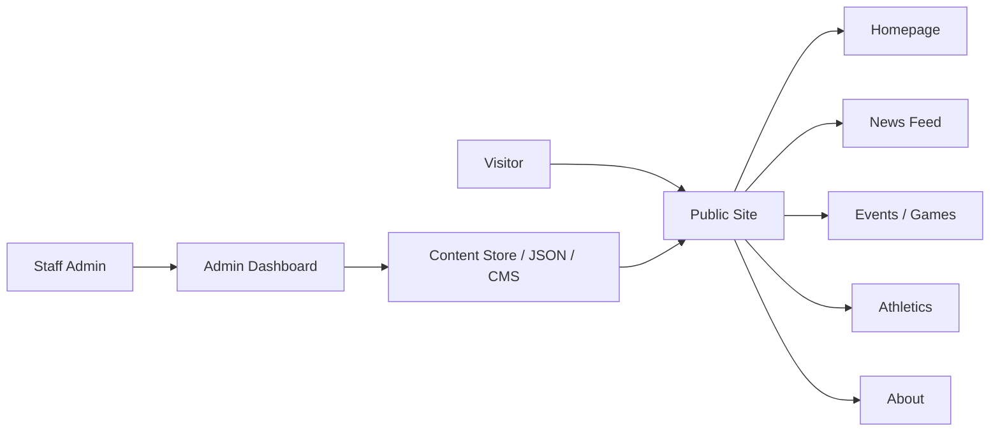

# Architecture Spine — Bexley Lions Site

## Design Paradigm

Use a simple layered architecture for the MVP:

- Public presentation layer: static HTML/CSS/JS pages that render school news, events, athletics, and about content
- Content layer: structured content objects for news and event records with consistent metadata
- Administration layer: a lightweight dashboard for creating, editing, and publishing content
- Delivery layer: static hosting with a minimal persistence option for admin-managed content

This keeps the product easy to maintain, fast to prototype, and aligned with the project goal: a credible school communications site without overbuilding a platform too early.

## Invariants & Rules

### AD-1 — Public site is content-first and static by default
- **Binds:** public pages, homepage, news, events, athletics, about
- **Prevents:** inconsistent page layouts, duplicated content logic, and excessive coupling between rendering and content management
- **Rule:** All public pages must read from a shared content model and render through a common layout pattern; each page should be built from a reusable structure rather than ad hoc one-off HTML.

### AD-2 — Public content and admin workflow are intentionally separated
- **Binds:** admin dashboard, content publishing, public site rendering
- **Prevents:** accidental leakage of staff tools into public pages and drift between published and draft states
- **Rule:** Admin operations must be isolated from the visitor-facing experience; staff actions can update content, but they do not change the public site layout directly.

### AD-3 — News and event content use a single schema
- **Binds:** news posts, event items, featured content, homepage highlights
- **Prevents:** divergent field names, inconsistent sorting, and manual content handling errors
- **Rule:** Every content item must carry at least title, date, summary, status, and publication metadata; events also require time/location/opponent data when applicable.

### AD-4 — Mobile-first usability is an architectural requirement, not a styling preference
- **Binds:** homepage, navigation, cards, event listings, article readability
- **Prevents:** poor mobile discoverability and unreadable layouts on small screens
- **Rule:** The interface must prioritize readability, touch targets, and simple navigation on phones before visual richness on larger screens.

### AD-5 — The implementation must favor boring technology for the first build
- **Binds:** MVP stack selection, content management, deployment strategy
- **Prevents:** premature complexity, platform churn, and excessive engineering overhead
- **Rule:** The initial build should prefer a simple static front-end with an intentionally lightweight admin path; any CMS or backend must be justified by actual publishing needs rather than speculative future scope.

## Consistency Conventions

| Concern | Convention |
| --- | --- |
| Naming (entities, files, interfaces, events) | Use clear domain names: `news`, `events`, `athletics`, `about`, `admin`, `draft`, `published` |
| Data & formats | Dates use ISO-like values; content entries carry a consistent published/draft state; renderers handle optional image metadata gracefully |
| State & cross-cutting | Drafts and published items must remain visibly distinct; admin actions should always be reversible and traceable |

## Stack

| Name | Version |
| --- | --- |
| HTML | current static markup |
| CSS | modern responsive stylesheet with reusable classes |
| JavaScript | lightweight DOM-driven interactivity |
| Tailwind CSS | recommended for rapid styling consistency |
| Hosting | static hosting such as Vercel or similar |
| Content persistence | JSON/flat-file storage or lightweight CMS option for MVP |

## Structural Seed



```text
Bexley-Lions/
  index.html
  about.html
  events.html
  athletics.html
  news.html
  admin.html
  styles.css
  script.js
  assets/
  docs/
    prd.md
    epics-and-stories.md
    website-plan.md
```

## Capability → Architecture Map

| Capability / Area | Lives in | Governed by |
| --- | --- | --- |
| View school homepage | homepage layout and shared components | AD-1, AD-4 |
| Browse recent news | news page and article cards | AD-1, AD-3 |
| View upcoming games and events | events page and homepage highlights | AD-1, AD-3 |
| Manage school content | admin dashboard | AD-2, AD-3 |
| Maintain trust and brand presence | header, hero, color, typography, emergency content flow | AD-4, AD-5 |

## Deferred

- Final selection of CMS/backend technology remains open until the team chooses whether they want a true headless content layer or a static-file approach for the initial release.
- Authentication model, staff roles, and multi-user admin permissions are intentionally deferred until publishing needs and security requirements are confirmed.
- Rich media storage, galleries, and advanced scheduling features are deferred beyond MVP scope.
